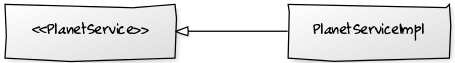

**Star Wars Planet**
====================
 

É um projeto desenvolvido como desafio para criar um conjunto de operações 
(api) que permitam o cadastramento dos planetas mencionados nos filmes 
Star Wars

**Arquitetura Básica dos Projetos**
-----------------------------------

### **Domínio**

As classes do diagrama abaixo representam o modelo de domínio básico definido
para os projetos

 

### **Request Padrão**

-   No projeto starwarsplanet os request seguem o padrão descrito no
    diagrama acima.

No projeto starwarsplanet os controladores são implementados através das
classes:

### **Services**

Os serviços de negócio são acessados através de interfacces que são
implementadas seguindo basicamente o exemplo do diagrama abaixo:

 

 
No projeto definiu-se uma classe abstrada BaseService.java que
implementa alguns métodos que são reaproveitados por todos os serviços.

 
### **Persistência**

 
A camada de persistência do projeto foi implementada através
do Spring Data JPA. As interfaces anotadas com @Repository definem as operações
necessárias.

 

**Documentação da Api REST.**
-----------------------------

 
A documentação (resumida) da api rest implementada pelo projeto
pode ser consultada após o projeto ser iniciado, através da
url: http://localhost:8080/swagger-ui.html#/planet-resource

 

  

**Executando os projetos**
--------------------------

 
Para executar os projetos podem ser utilizados os seguintes comandos, após
baixar o zip do projeto.

1.  Ir para o diretório específico da aplicação

2.  Executar o comando: mvn spring-boot:run

3.  Os dois projetos deve estar iniciados.

4.  A url é: http://localhost:8080/api/planets

 

 
